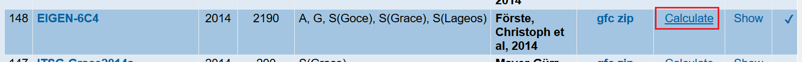
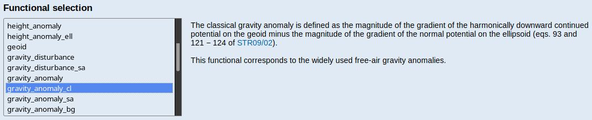
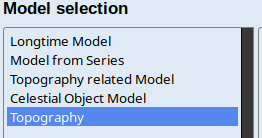
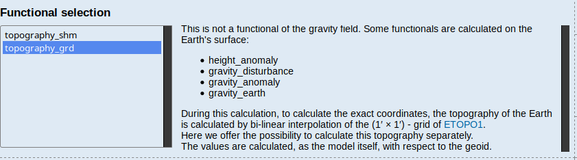

# SphericalBouguer

This is an example of how to compute the full spherical Bouguer correction
(inkl. terrain corretion) using [Tesseroids](http://tesseroids.leouieda.com/en/stable/) and [GMT](https://gmt.soest.hawaii.edu/).

The script utilises `gdf` files that are obtained from the calculation service of [ICGEM](http://icgem.gfz-potsdam.de/home).

**Recommended literature**: [Definition of functionals of the geopotential and their calculation from spherical harmonic models](http://icgem.gfz-potsdam.de/theory)

## Obtaining the files from ICGEM

Choose the desired model from the `Static Models` list and click on `Calculate`
**Free-air anomaly**



Select the region and choose a lateral resolution that corresponds to the maximum degree/order of the model. For EIGEN-6C4 with max. degree/order 2190 this is 0.0822°. The free-air anomaly is called `gravity_anomaly_cl`



Also download the topography from ICGEM, because this is where ICGEM computes the gravity.



and under functionals



## Script settings

The script relies on [`tesspar`](../Tesseroids) for parallelisation. Make sure to add the location of the script to the path, e.g. by adding

```bash
export PATH=/path/to/repo/Gravity/Tesseroids/:$PATH
```
to the beginning of the script. Do not forget to replace `/path/to/repo` with the correct path to where you cloned this repository to. The location to the tesseroids binaries must also be found in the `PATH` variable.

The file names, densities and resolutions can be adjusted in the bash file:

```bash
fFreeAir='./FreeAir_EIGEN-6C4_WGS84.gdf' # The free-air anomaly from ICGEM
fTopo='./ETOPO1.gdf' # Topography with the same bounds and resolution
rhocrust=2670     # Density / kg/m3
rhowater=1645     # Density / kg/m3
dlon=0.0822       # Resolution / ° longitude
dlat=0.0822       # Resolution / ° latitude
dz=1              # Station height above topography / m
# tesspar settings
n=90              # Total number of threads used for the computation
nx=10             # Threads in longitudinal direction
```
