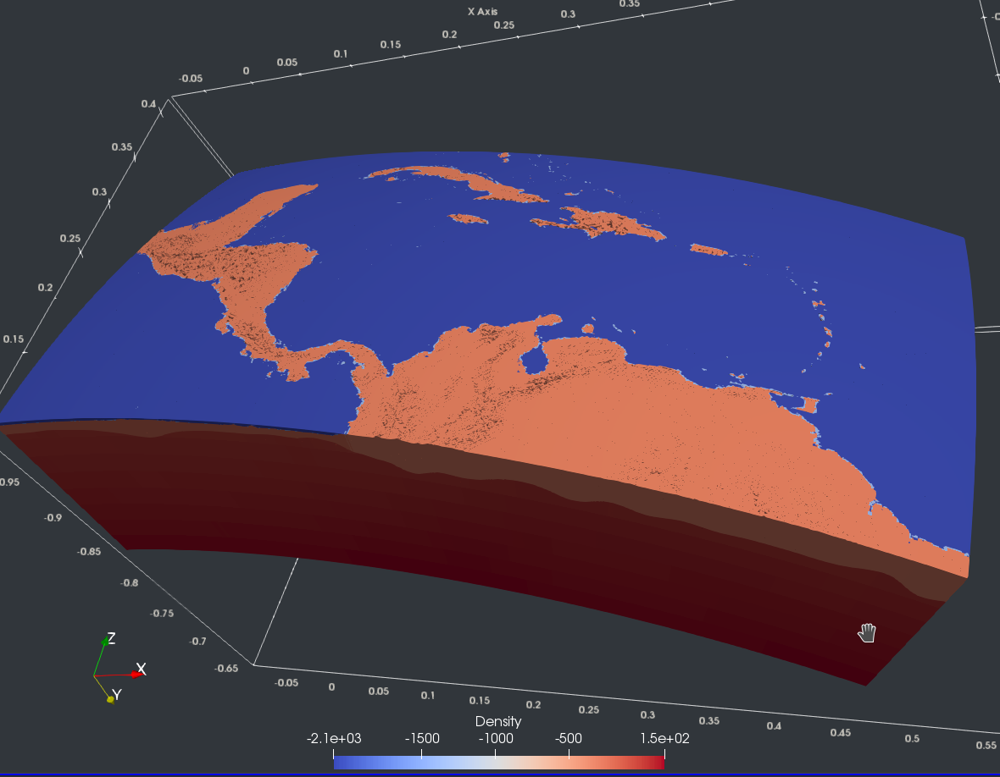

# Scripts for Tesseroids

Scripts that make life with [Tesseroids](http://tesseroids.leouieda.com/en/stable/) a bit easier.

## tess2vtu

Converts a tesseroid model to a vtu file that can be opened in ParaView. Written
in Python 2.7. Attention: due to the vtu format, the file size increases
tremendously (see explanation below).

Example using the Model of the Caribbean from Gomez Garcia et al. (in review):



This model spans from 95 to 55°W and from 5 to 25°N with a resolution of 0.05°.
With about 15.8 Million tesseroids it has a vtu file size of 6.1GB. Opening it
in ParaView consumes almost 20GB of memory.

To obtain the spherical geometry use the calculator with

```
(1+coordsZ/6371000*VEXAGG)*(cos(coordsX*3.14159265/180)*cos(coordsY*3.14159265/180)*iHat+sin(coordsX*3.14159265/180)*cos(coordsY*3.14159265/180)*jHat+sin(coordsY*3.14159265/180)*kHat)
```

where `VEXAGG` is the vertical exaggeration. Also do not forget to check `Coordinate results` in the calculator.

## tesspar

Parallelise the computation of tesseroid models. The model region is subdivided
into smaller sub-regions of which each of the subregions is computed by one
thread. **NOTE:** Requires GMT 5.1, maybe also compatible with later GMT versions.

An example of how to use `tesspar` is the [full Bouguer correction](../SphericalBouguer).

Tesspar prints a short help when executed without arguments

```
$ tesspar

Not enough arguments.

Usage: tesspar MODEL STATIONS [args]

MODEL          - Tesseroids model
STATIONS       - NetCDF file with station height
-n INT         - Total number of threads
-nx INT        - Number of threads in E-W direction
-ny INT        - Number of threads in N-S direction
-o FILENAME    - Output filename (default gz.dat)
```
