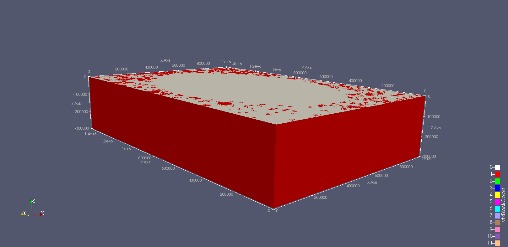
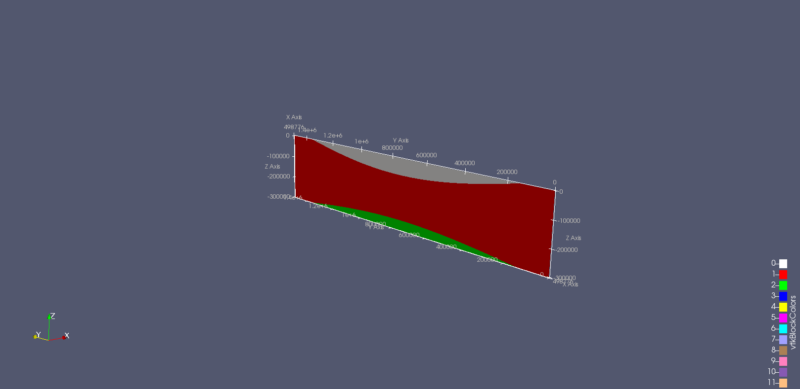
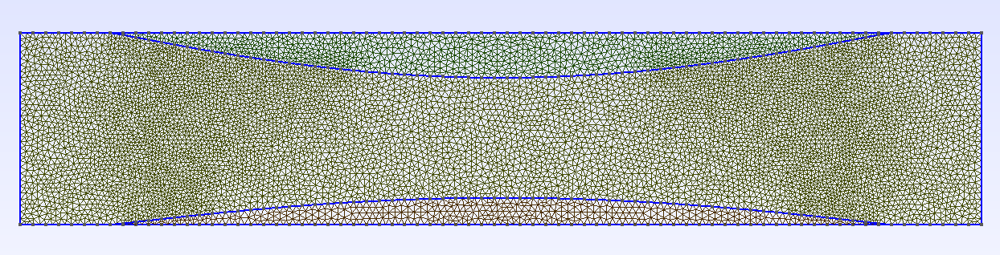

# paraview2gms

Converts profiles obtained in ParaView to gmsh for further usage e.g. in Lynx or Golem. Written in Python3.

**Todo**
  - command line support

## Prerequisites

Requires [Gmsh](http://gmsh.info/) and [pygmsh](https://github.com/nschloe/pygmsh).

## Example

Example files are located in the `example` folder.

The 3D model in `example/data/TBlank3D_T.e` (10-times vertically exaggerated!):


Using slice


Clicking `File - Save Data` as csv, generates the files `profile*csv`.

Then convert them with `example.py`

```python
import sys
from collections import OrderedDict
sys.path.append('../') # Required if you run it from the example folder
from paraview2gmsh import process

layers = OrderedDict()
BCs = dict()

layers['Sediments'] = './data/profile0.csv'
layers['Crust'] = './data/profile1.csv'
layers['Mantle'] = './data/profile2.csv'

BCs['Sediments'] = 'upper'
BCs['Mantle'] = 'lower'
lcar = 10e3  # Characteristic length

geo = 'example.geo'

process(layers, BCs, lcar, geo, vscale=10)
```

Generates the output `example.geo`. Opening and meshing in Gmsh then results in



This mesh contains a physical line `Top` at the top and `Bottom` at the base.
They can diretly be referenced in moose configuration files.
